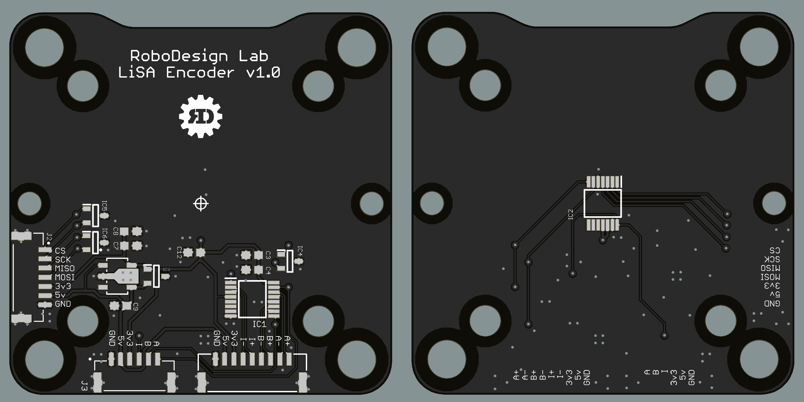

# HMI_LISA_Encoder
Design Files for an AS5147U encoder for the RoboDesign Lab HMI Actuators.
 
- All outputs support 14 bits and can be used simultaneously. 
- All signals/power routed to conenctors are protected from ESD.

- Output Options:
    - Differential ABI
    - Single-Ended ABI
    - Absolute SPI
 

- Power Input Options:
    - 3.3v
    - 5v
 

 

  

  

